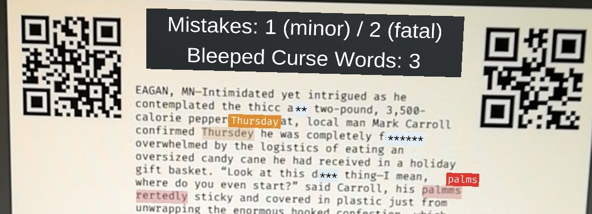
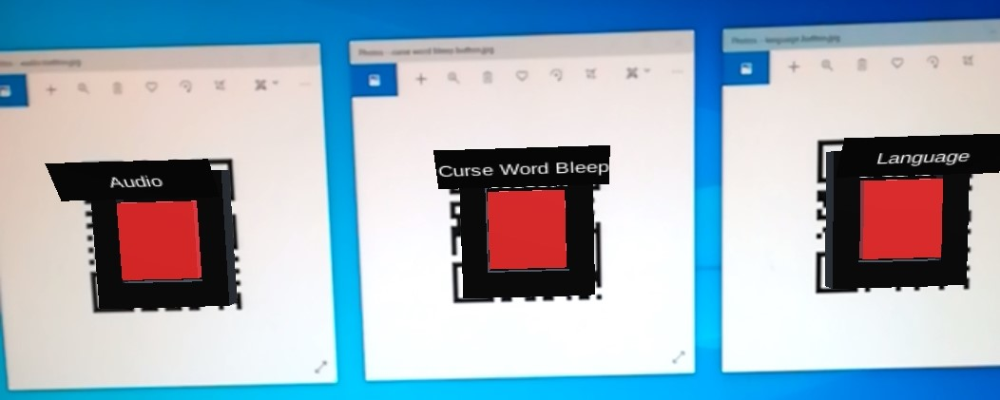
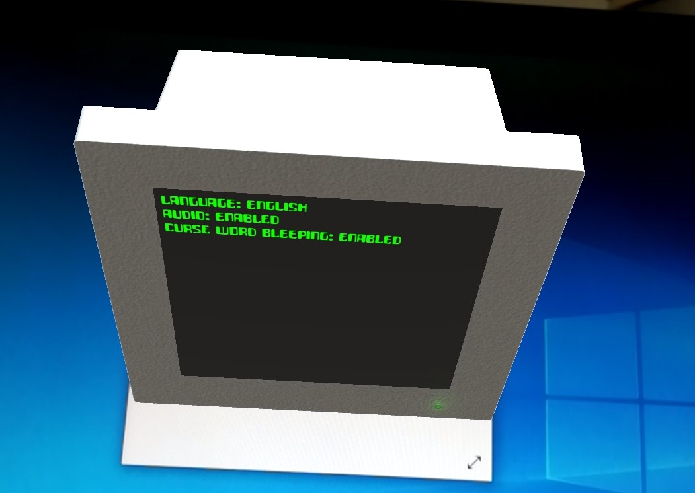

# GrammAR

_grammAR_ is a prototypical AR application that helps to detect spelling mistakes on physical paper.

## Prerequisites

* Unity (Version 2019.2.4f1)
* Vuforia (Version 8.5.9)

## Feature Roadmap

- [x] Spell check and and annotate misspelled words
- [x] Detect text changes and only refresh results if different sheet is shown
- [x] Audio cues for results loading/no errors/errors detected
- [x] Virtual Button for language selection (with a marker)
- [x] Curseword bleep 
- [ ] Extract text with OCR library
- [ ] Replace sheet tracking through markers with actual sheet-detection
- [ ] Loading Spinner while loading the results
- [ ] Error message if text could not be detected
- [ ] Enhanced Error Message (based on threshold e.g. if 50% could not be detected an error is shown, otherwise words will be ignored)
